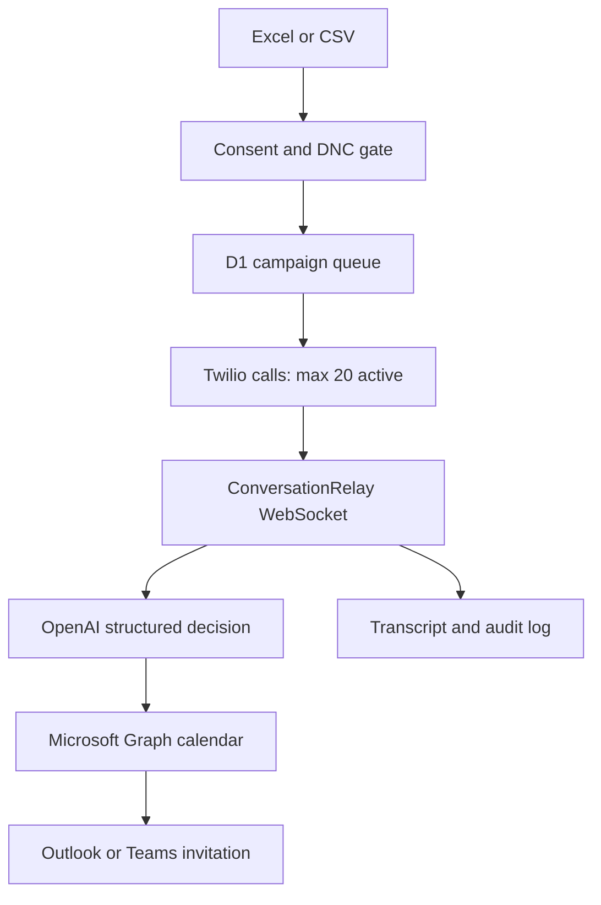

# ODIN AI Appointment Dialer

A private, compliance-gated outbound calling workspace for consented prospects. It imports `.xlsx` or `.csv` workbooks, runs up to 20 simultaneous Twilio voice sessions, uses an explicitly disclosed OpenAI agent to qualify interest, and creates confirmed appointments in Microsoft Outlook.

> This project intentionally does not provide an “upload and blast” mode. A prospect must have documented prior express written consent, current DNC-screening evidence, a valid phone number, and a known IANA timezone before the number can enter Twilio.

## What is implemented

- Authenticated control-room dashboard with live campaign, call, appointment, integration, and audit views
- Browser-side Excel/CSV parsing with normalized field aliases and server-side revalidation
- D1 persistence for prospects, campaigns, queues, calls, transcripts, meetings, encrypted OAuth tokens, settings, and audit events
- Maximum 20 active calls per campaign, with the provider’s Calls API queue handling account-level calls-per-second limits
- Twilio webhook HMAC validation and a signed ConversationRelay WebSocket endpoint
- Mandatory AI and sales-call disclosure in the Twilio greeting, before the model handles any speech
- Structured OpenAI Responses API decisions with a deliberately small action surface
- Independent server-side opt-out detection that immediately revokes consent and suppresses future calls
- Outlook OAuth 2.0 connection, token refresh, calendar availability checks, and Outlook/Teams event creation
- Explicit booking checks: exact offered slot, valid email, and affirmative confirmation are all required
- Checked Drizzle migration, responsive UI, social card, CI workflow, linting, type checks, and unit tests

## Architecture



Twilio performs telephony, speech recognition, and speech synthesis through ConversationRelay. The Worker receives prospect speech as text, asks OpenAI for a constrained structured decision, executes only approved server-side actions, and returns text for Twilio to speak. Audio is not sent through the app’s database.

## Import workbook

Download the template from the Prospects view. Supported headers and common aliases include:

| Field | Required to call | Notes |
| --- | --- | --- |
| `first_name`, `last_name` | No | Missing names receive safe placeholders. |
| `phone` | Yes | North American numbers are normalized to E.164. |
| `timezone` | Yes | Use an IANA value such as `America/Chicago`. It is not guessed from state. |
| `consent_status` | Yes | Must state `prior express written consent`, `express written consent`, or `PEWC`. A vague `yes` is blocked. |
| `consent_timestamp` | Yes | Must be a real date and cannot be in the future. |
| `consent_source` | Yes | Where consent was captured. |
| `consent_evidence` | Yes | A durable record identifier or evidence reference. |
| `dnc_checked_at` | Yes | Must be no more than 31 days old. |
| `internal_dnc` | Yes | Truthy values force suppression. |
| `email` | Required to book | The agent can ask for and confirm a missing email. |

Importing a row never creates or infers consent. Duplicates are skipped by normalized phone number. Blocked rows remain visible with their exact reasons and are never queued.

## Environment

Copy `.env.example` for local development, or set these as encrypted production environment variables:

| Variable | Purpose |
| --- | --- |
| `APP_BASE_URL` | Canonical HTTPS URL used for Twilio callbacks and Microsoft OAuth. |
| `APP_OWNER_EMAIL` | Optional single-owner API allowlist. |
| `APP_ENCRYPTION_KEY` | Base64-encoded 32-byte AES-GCM key for Microsoft tokens and OAuth state. |
| `TWILIO_ACCOUNT_SID` | Twilio account identifier. |
| `TWILIO_AUTH_TOKEN` | Twilio REST credential and webhook-signing secret. |
| `TWILIO_FROM_NUMBER` | Voice-capable E.164 caller ID owned or verified in Twilio. |
| `OPENAI_API_KEY` | Server-side OpenAI credential. |
| `OPENAI_MODEL` | Defaults to `gpt-5.6-terra`; use `gpt-5.6-luna` for lower-cost high-volume workloads after evaluation. |
| `MICROSOFT_CLIENT_ID` | Microsoft Entra application ID. |
| `MICROSOFT_CLIENT_SECRET` | Microsoft Entra client secret. |
| `MICROSOFT_TENANT_ID` | Tenant ID or `common` for multi-tenant/personal Microsoft accounts. |

Never commit real credentials. Generate the encryption key with `openssl rand -base64 32` and keep it stable; changing it invalidates stored Outlook tokens.

## Microsoft Outlook setup

1. Create an app registration in Microsoft Entra ID.
2. Add this Web redirect URI exactly:

   `https://odin-ai-dialer.derekmerf.chatgpt.site/api/outlook/callback`

   Use the matching `APP_BASE_URL` when deploying under another hostname.
3. Add delegated Microsoft Graph permissions: `User.Read` and `Calendars.ReadWrite`. The OAuth request also asks for `offline_access` so tokens can refresh.
4. Create a client secret and set the Microsoft environment variables.
5. Open Integrations in the dashboard and choose **Connect Outlook**.

The app reads calendar events for a ten-day window, offers up to three free weekday slots in the prospect’s local timezone, and creates an online meeting only after explicit confirmation.

## Twilio setup

1. Use a voice-capable Twilio number and complete the applicable business/caller identity profile.
2. In Twilio Voice settings, accept the Predictive and Generative AI/ML Features Addendum and finish ConversationRelay onboarding.
3. Set the three Twilio environment variables. The app creates outbound calls through the Calls API and supplies its own signed voice and status URLs; a manually configured TwiML App is not required for these outbound requests.
4. Confirm the account’s ConversationRelay concurrency allowance supports the desired active-call count.
5. Confirm the Calls API creation rate. Twilio’s standard account rate is commonly one call per second, while approved Business Profiles may request higher throughput. The app’s concurrency limit controls active sessions; Twilio queues call creation according to the account’s CPS.

All Twilio HTTP and WebSocket requests are rejected unless the `X-Twilio-Signature` validates against `TWILIO_AUTH_TOKEN`.

## OpenAI agent

The agent uses the Responses API with strict JSON Schema output. It can request only five actions:

- continue the conversation;
- list real Outlook slots;
- book one confirmed slot;
- enforce an opt-out;
- end the call.

The system prompt requires AI identity, one question at a time, concise natural speech, no invented product or pricing claims, no pressure after disinterest, and no claim that a meeting is booked until Microsoft Graph succeeds. API requests set `store: false`.

## Calling and compliance behavior

- Strict local window: weekdays, 9:00 AM–4:30 PM in the prospect’s timezone
- Maximum DNC-screen age: 31 days
- Maximum active sessions per campaign: 20
- Every lead is revalidated immediately before dialing
- Any clear “do not call,” “remove me,” or equivalent phrase bypasses the model and triggers immediate internal suppression
- Simple disinterest ends the pitch but is not silently treated as a permanent opt-out
- The opening greeting says the caller is an AI assistant and that the purpose is a sales call
- Launch requires a human attestation in the dashboard

These are conservative technical controls, not legal advice. The operator remains responsible for federal, state, provincial, international, industry, caller-ID, recording, licensing, consent-revocation, and time-of-day requirements. Obtain legal review before production calling.

## Development

Requirements: Node.js 22.13 or later.

```bash
npm ci
npm run db:generate
npm run dev
```

The Sites runtime supplies the `DB` D1 binding declared in `.openai/hosting.json`. The checked SQL migration lives in `drizzle/`. For a separate local Cloudflare environment, bind a local D1 database as `DB` and apply the same migration before using the dashboard APIs.

Verification:

```bash
npm run lint
npx tsc --noEmit
npm test
```

`npm test` performs a production build and runs compliance, workbook-mapping, Twilio-signature, and deployable-artifact tests.

## Production checklist

- [ ] Restrict the site to the intended owner/workspace and set `APP_OWNER_EMAIL`.
- [ ] Add all secrets through the hosting environment, never through source control.
- [ ] Connect Outlook and verify a disposable test event can be created.
- [ ] Complete Twilio ConversationRelay onboarding and confirm concurrency/CPS limits.
- [ ] Verify caller identity, branded calling, and any registration required in target regions.
- [ ] Run a consented test call to your own number and exercise interruption, no-interest, booking, and opt-out paths.
- [ ] Review the product brief for factual accuracy before every campaign.
- [ ] Have counsel approve the target audience, consent evidence, calling windows, disclosures, recording policy, and retention policy.

## Key routes

| Route | Use |
| --- | --- |
| `/api/dashboard` | Aggregated private dashboard state |
| `/api/leads/import` | Server-validated workbook rows |
| `/api/campaigns` | Create protected campaign queues |
| `/api/campaigns/:id/launch` | Attested, revalidated launch |
| `/api/outlook/connect` | Start Microsoft OAuth |
| `/api/outlook/callback` | Store encrypted Microsoft tokens |
| `/api/twilio/voice` | Signed TwiML for each outbound call |
| `/api/twilio/status` | Signed lifecycle callback and queue drain |
| `/api/twilio/conversation` | Signed ConversationRelay WebSocket |

## Data handling

- Outlook tokens are encrypted at rest with AES-256-GCM.
- Phone numbers are masked in dashboard API responses.
- The app stores text transcripts, outcomes, and audit events; define an organizational retention policy before production use.
- The social card and public metadata contain no customer data.
- Secrets never reach the browser bundle.
